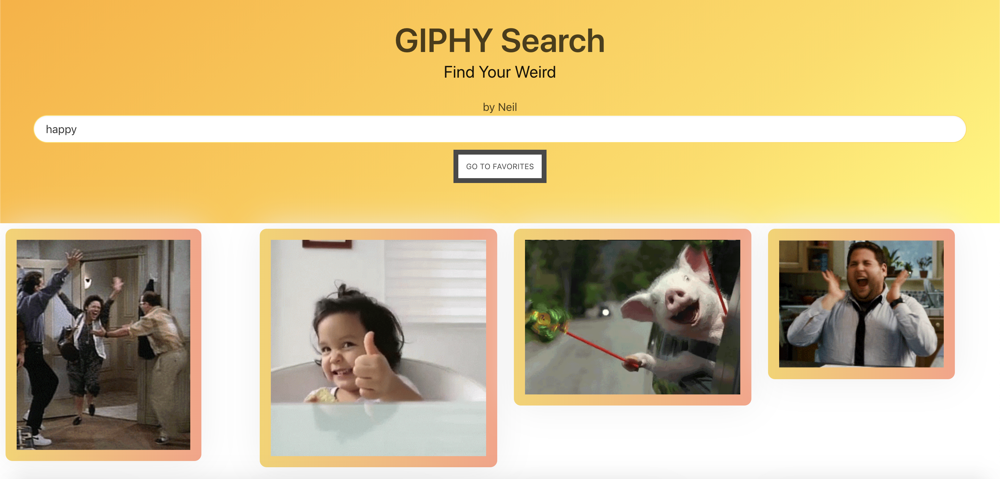

# Welcome to GIPHY by Neil V. 
## A REACT app to find your weird via gifs.

## SEE IT LIVE :blush:

[Live version here, Click Me.](http://zonked-woman.surge.sh/)

## USAGE

* Search for Gifs using the input field
* Click on a gif to add it to your saves
* Click view favorites to see your saves
* Click back to homepage to return to GIPHY search

# Getting Started
* Clone this repository
* cd into the project folder
* Run
`npm install && npm start`
* Enjoy!

# Authors
* **Neil V.** - *Initial work* - [Github](https://github.com/urbanvas)

# Links

[LinkedIn](https://www.linkedin.com/in/neilvseejoor/)

## Contributing

Bug reports and pull requests are welcome on GitHub at https://github.com/urbanvas/budget. This project is intended to be a safe, welcoming space for collaboration, and contributors are expected to adhere to the [Contributor Covenant](http://contributor-covenant.org) code of conduct.

## License

The app is available as open source under the terms of the [MIT License](https://opensource.org/licenses/MIT).

## Code of Conduct

Everyone interacting in the GIPHY Search project’s codebases, issue trackers, chat rooms and mailing lists is expected to follow the code of conduct.
